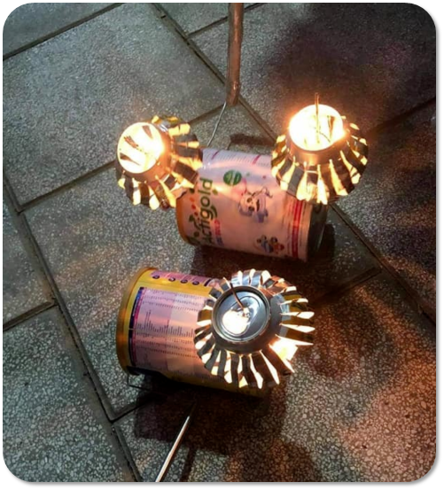
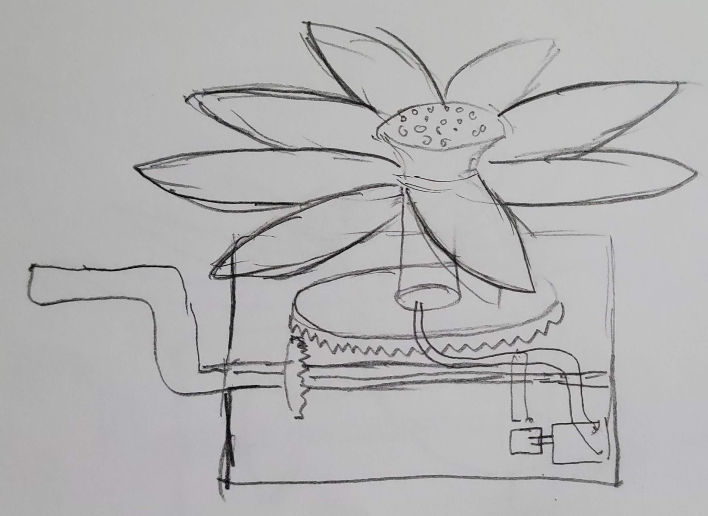
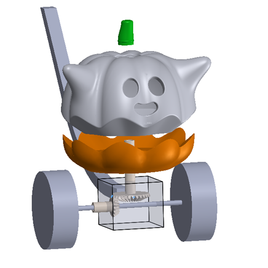
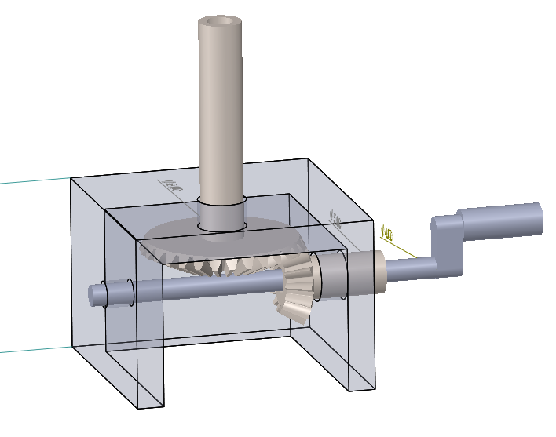
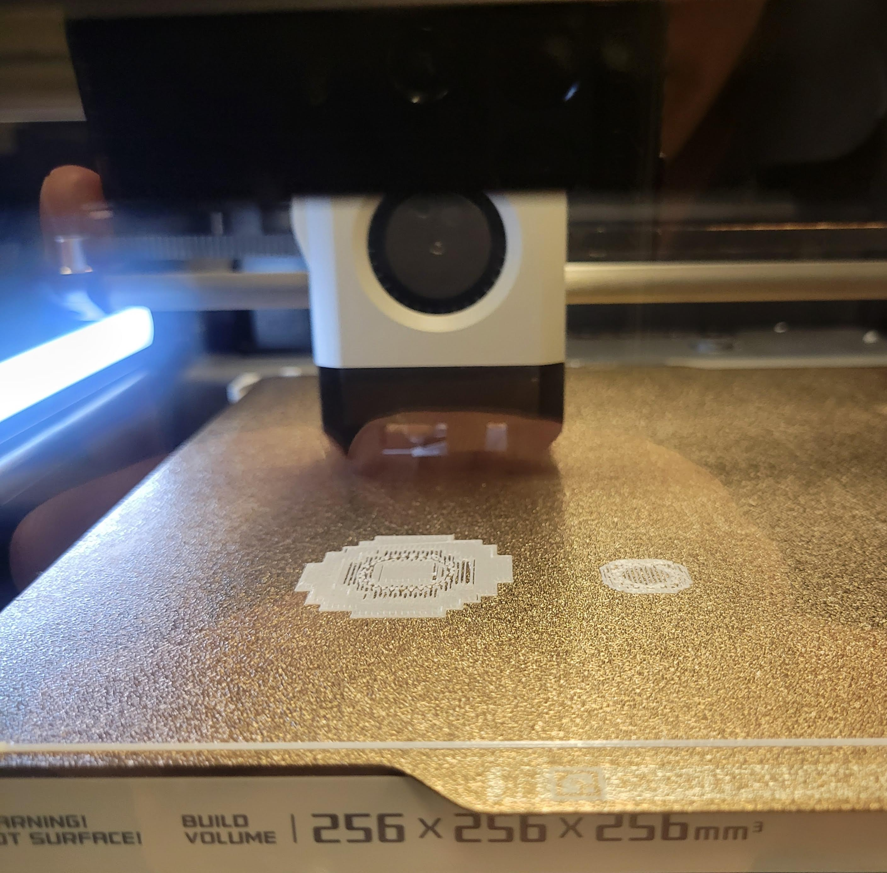
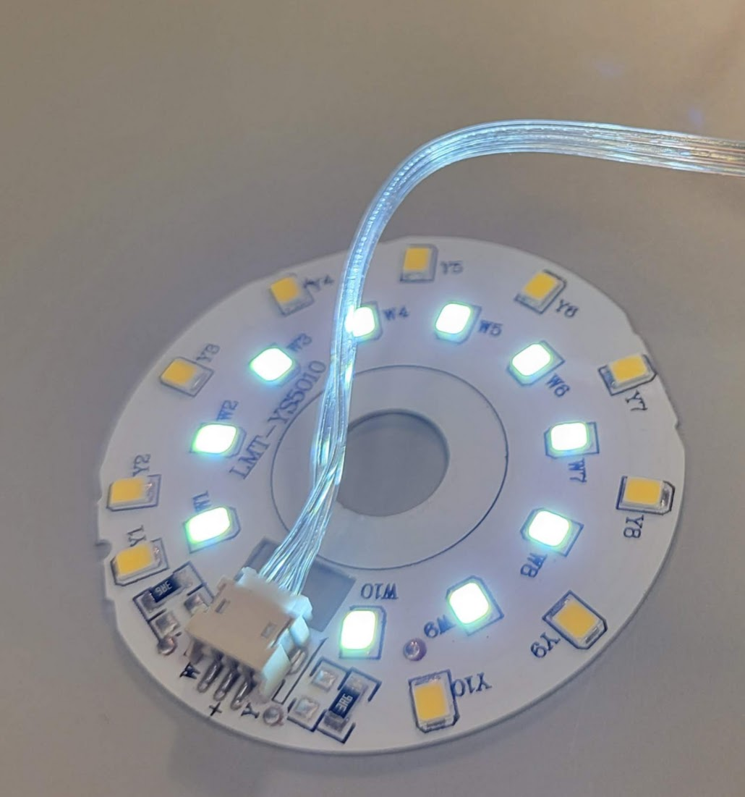
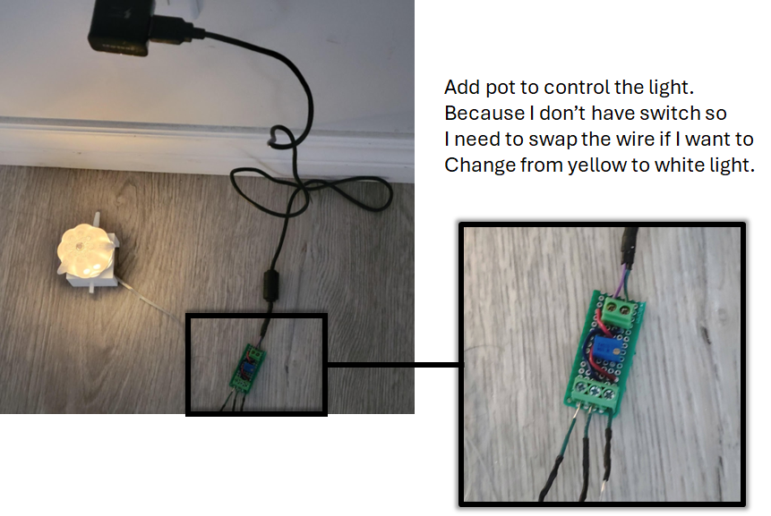

# Motivation

Toys are fun. They bring joy to both kids and grown-ups. Let's make more toy.

# First Toy

I always look for mid-autum festival to hangout with friends with our handmade lanterns.

The toy above is called "Đèn Lon" which litterally means tin can lattern.  Can is stacked on the other to make a bevel gear. Since can is flat, friction is the only force that make the top can move when the bottom can rotate.

Based on that mechanism, I want to make the toy as below. 

The flower mechanism seemed to be difficult at the time when I sketched the diagram; however, Make: magazine ([3D Print This Blooming Flower Night Light - Make:](https://makezine.com/projects/3d-print-this-blooming-flower-night-light/)) shows how make them move with just one servo moving in Z direction. I also designed a version with wheels.

However, to test it first, I need to have something simpler. 

Cool! ready to print.

I was lucky to find a working LED board in a waste bin

Everything is put together as the below image.

Tadaaaaa!!!

I think the size of a pumpkin need to be bigger. 
