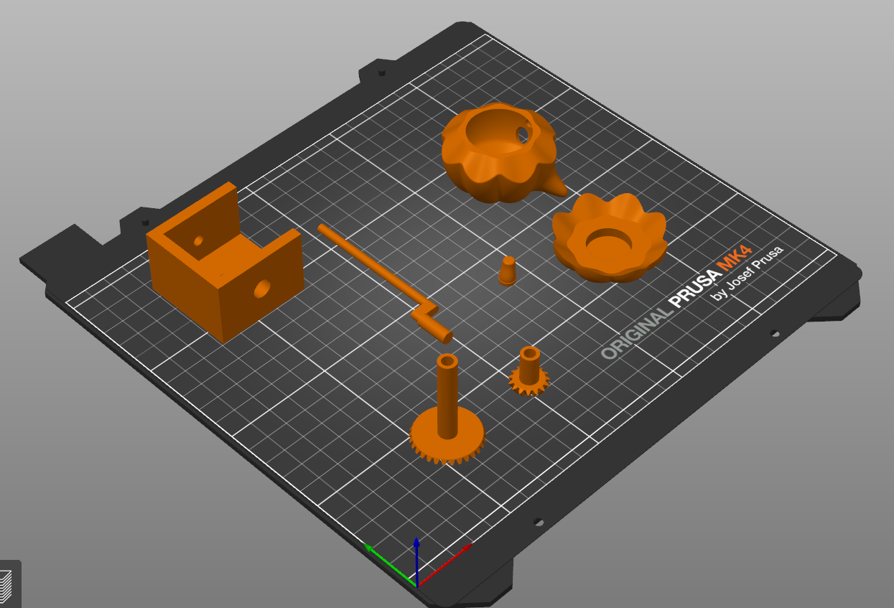

# 3D model

# Final product

# First Toy

When I was a kid, I always looked for mid-autum festival to show our handmade lanterns and hangout with friends.

The toy above is called "Đèn Lon" which litterally means tin can lattern. A can is stacked on top of the other to make a bevel gear. Since the cans don't have gear, friction is the only force that makes the top tin can moves when the bottom tin can rotates.

Based on that mechanism, I want to make the toy as below. 

The flower mechanism seemed to be difficult at the time when I sketched the diagram; however, Make: magazine ([3D Print This Blooming Flower Night Light - Make:](https://makezine.com/projects/3d-print-this-blooming-flower-night-light/)) shows us how to make them move with just one servo moving in top to bottom direction. I also designed another version with wheels.

However, to test a design with wheels, I need to have something simpler as below. 

Cool! the design is ready to print now.

I was lucky to find a working LED board in a waste bin. Thanks UWRepairHub

Everything is put together as the below image.

Tadaaaaa!!!

I think the size of a pumpkin need to be bigger. 

# Credit to

[Ghost Pumpkin by Sabre Design | Download free STL model | Printables.com](https://www.printables.com/model/618595-ghost-pumpkin)
